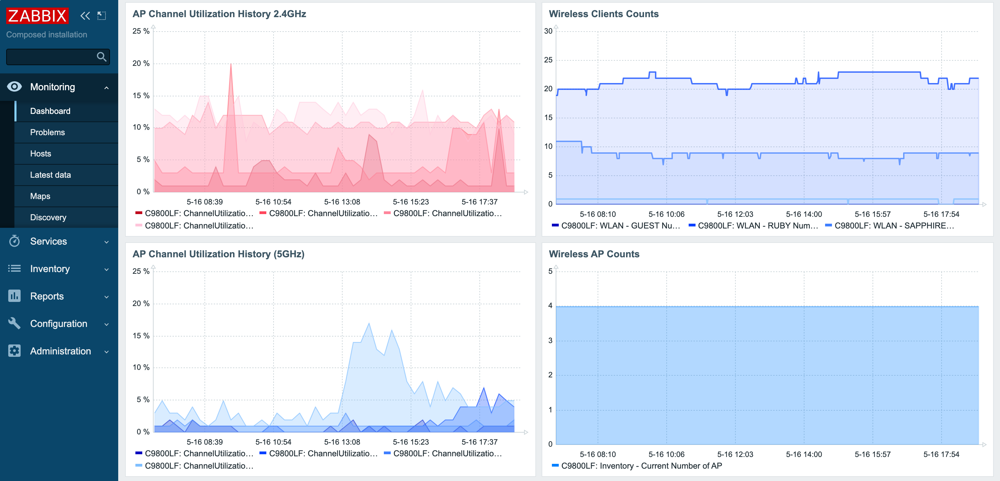
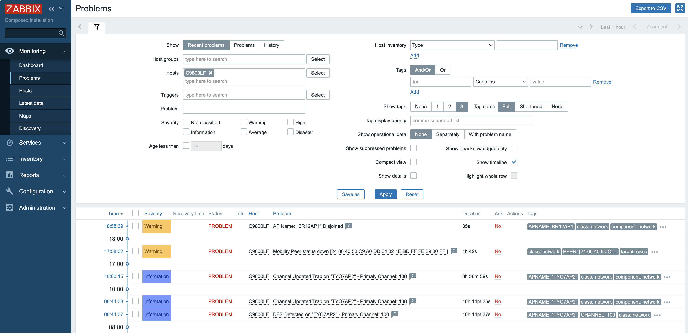

# zabbix-cisco-9800 (RESTCONF)
Zabbix Template for Cisco Catalyst 9800 Series Wireless Controller (RESTCONF version).<br>
Japanese version is [here](README-ja.md)

## Purpose
Starting with IOS XE 17.18.2, Cisco is progressively deprecating legacy and insecure features/protocols, encouraging migration to more secure alternatives. This is part of a broader initiative to make Cisco products more secure by default and secure by design.
As part of this initiative, Cisco is encouraging customers to migrate from SNMPv2 to SNMPv3.
Although SNMPv3 is already supported by Zabbix and works with the traditional "Cisco Catalyst 9800 SNMP" template, strict encryption in SNMPv3 has been observed to slow down data retrieval even in environments with only a few Access Points. Furthermore, Cisco has nearly stopped development for SNMP and recommends using streaming telemetry such as NETCONF/RESTCONF/gRPC for future monitoring.

For smooth migration of encrypting management traffic, this Zabbix template has migrated the majority of its functions to RESTCONF. Since there is currently no mechanism in Zabbix to receive streaming telemetry for real-time notifications, SNMP Traps are still used for items requiring real-time alerting.

> [!NOTE]
> This template specializes in wireless LAN monitoring. For CPU utilization, Memory utilization, interface stats, and inventory items, it is intended to be used in conjunction with "Cisco IOS by SNMP".

### Reference URL
Release Notes for Cisco Catalyst 9800 Series Wireless Controller, Cisco IOS XE 17.18.2
https://www.cisco.com/c/en/us/td/docs/wireless/controller/9800/17-18/release-notes/rn-17-18-2-9800.html

## Requirements

- Cisco Catalyst 9800 Series Wireless LAN Controller
  - RESTCONF must be enabled (IOS XE 16.10 or later recommended)
  - HTTP(S) Server must be enabled
- Zabbix 7.0 or later

## Configuration (Cisco Catalyst 9800 WLC)

Enable RESTCONF and the HTTPS server on the Cisco Catalyst 9800 WLC, and create a user with appropriate privileges.

```cisco
configure terminal
 ip http secure-server
 restconf
 username [USER] privilege 15 secret [PASSWORD]
end
```

Example configuration for using SNMP Traps (SNMPv3 Recommended):
```cisco
! Enable Traps
snmp-server enable traps wireless bsnAutoRF
snmp-server enable traps rf

! Create SNMPv3 Group and User (AuthPriv mode)
snmp-server group [SNMPv3 Group] v3 priv
snmp-server user [SNMPv3 Username] [SNMPv3 Group] v3 auth sha [AUTH_PASS] priv aes 128 [PRIV_PASS]

! Configure Trap Destination
snmp-server host [ZABBIX IP ADDRESS] version 3 priv [SNMPv3 Username]
```

## Usage

1. Import the template into Zabbix.
2. Set the macros on the host. Change the username and password according to your environment.

| Macro | Description | Default Value |
| --- | --- | --- |
| `{$RESTCONF.URL}` | Base URL for RESTCONF. Usually does not need to be changed. | `https://{HOST.CONN}/restconf/data` |
| `{$RESTCONF.USER}` | Username for RESTCONF connection | `admin` |
| `{$RESTCONF.PASS}` | Password for RESTCONF connection | `Cisco123` |

## Discovery Rules

| Name | Description | Type | Update Interval |
| --- | --- | --- | --- |
| Mobility Node Discovery | Discovers mobility group members and monitors tunnel status. | Dependent | 0 (Follows Master item) |
| Radio Slot Discovery | Discovers AP radio slots and dynamically maps AP name and frequency band (2.4/5/6GHz).<br>Creates items using AP Name instead of MAC address. | Script | 1h |
| WLAN SSID Discovery | Discovers SSIDs (WLAN profiles) and monitors client counts. | Dependent | 0 (Follows Master item) |

## Items

### HTTP Agent / RESTCONF
Main metrics retrieved via RESTCONF.

| Name | Description | Type |
| --- | --- | --- |
| HA Local State | HA Local Status (Active/Standby etc.) | Dependent |
| HA Peer State | HA Peer Status | Dependent |
| HA Last Switchover Reason | Reason for the last switchover | Dependent |
| CPU Utilization | CPU Utilization (one-minute) | HTTP Agent |
| Memory Utilization | Memory Utilization (Processor) | HTTP Agent |
| Rogue AP: Total Count | Total count of detected Rogue APs | HTTP Agent |
| Rogue AP: Total Client Count | Total count of clients connected to Rogue APs | HTTP Agent |
| AP {#AP.NAME} ({#FREQ.NAME}): Channel Utilization | Channel utilization per AP/Frequency (CCA) | Dependent |
| AP {#AP.NAME} ({#FREQ.NAME}): Client Count | Client count per AP/Frequency | Dependent |
| AP {#AP.NAME} ({#FREQ.NAME}): Noise Level | Noise level per AP/Frequency | Dependent |
| SSID {#WLAN.NAME}: Client Count | Client count per SSID | Dependent |

### SNMP Trap
Events requiring real-time notification are received via SNMP Trap.

| Name | Description | Type |
| --- | --- | --- |
| SNMP Trap - Channel Changed | AP Channel Changed Trap (bsnAPCurrentChannelChanged) | SNMP Trap |
| SNMP Trap - RadarChannelDetected | DFS Radar Detected Trap (bsnRadarChannelDetected) | SNMP Trap |
| SNMP Trap - AP disassociation | AP Disassociation/Reassociation Trap (bsnAPDisassociated / ciscoLwappApAssociated) | SNMP Trap |

## Screenshots



## Test Environment
- Cisco Catalyst 9800-L wireless controller
- IOS XE 17.15.4d
- Zabbix 7.0.22
